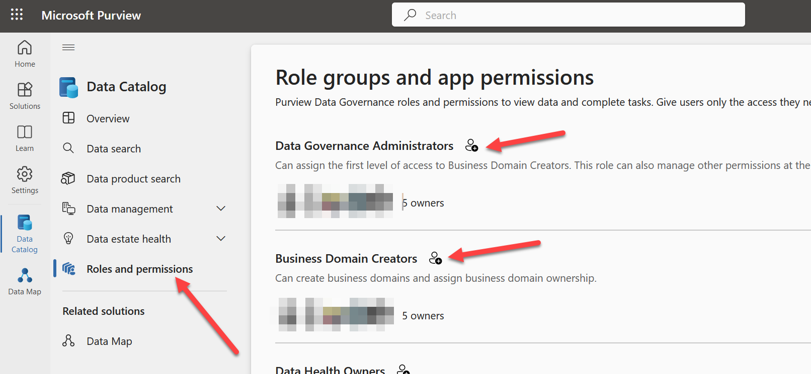
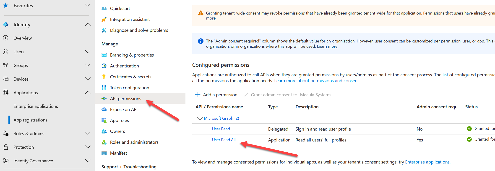

# Credentials

## Service Principal Account

Currently these applications only support a service principal account for authentication to both the Azure Purview and Microsoft Purview api's.

Both applications can share the credentials file, so this only needs to be created once.  Both applications have the credentials command so it doesn't matter which application creates it.  purview-migrate.exe or purview-import.exe.

When you run the credentials command it will generate a credentials.json file, that file needs to be in the same folder that the application is in.

Here is the help information for context of what the credentials command looks like.

The Client Secret is encrypted using the windows DPAPI, so if the file gets moved to a different user, or a different computer, it will not work, and will need to be regenerated for that user/computer.

## credentials command

Set the credentials for the migration tool

There are specific required parameters for this command, and this is required before any of the other commands can be run.

*Parameters:*

> `--client-id`
>
> The client id to use for authentication. See: https://learn.microsoft.com/en-us/purview/tutorial-using-rest-apis

> `--client-secret`
>
> The client secret to use for authentication. See: https://learn.microsoft.com/en-us/purview/tutorial-using-rest-apis

> `--azure-purview-url`
>
> The Azure Purview URL to use for integration. In your azure portal (portal.azure.com), go to your Microsoft Purview Account (not in the Purview Application itself) and select Settings > Properties.  Look for the Atlas endpoint.

> `--tenant-id`
>
> The Azure Tenant Id (GUID) to use for integration

*Example:*

`purview-import credentials --client-id d711c4b8-a919-4fe6-81e7-213ecfb46d4a --client-secret`
`5ecb67170d084474a355b3c0a834b14a --tenant-id d94627ed-d46d-407c-bd61-cd8077013034 --azure-purview-url`
`https://myapp-purview.purview.azure.com`

------

### Parameter values

`--client-id` and `--client-secret`

This post explains how to create the service principal account https://learn.microsoft.com/en-us/purview/tutorial-using-rest-apis

When you create that account, you need both the client id, and the client secret generated to run this credentials command.

`--tenant-id`

You will also need your tenant id, a guid from your azure subscription that hosts your Purview instance.

 `--azure-purview-url`

for your azure purview url parameter, you will need to log into the azure portal, and go to the Purview Properties page and navigate to Settings > Properties.  Look for the atlas endpoint property, and copy that value, without the /catalog at the end of the url.  This is the value to use for your --azure-purview-url parameter when setting credentials.

## Authorization

Once this account is created, you will need to give it some authorization.

#### Purview Authorization

The service principal account that was created needs to be added to the Data Governance Administrators as well as the Business Domain Creators roles within the Purview application.

In addition, if any actions need to be performed on existing Business domains (such as add owners), the service  principal account needs to be granted Business Domain Owner, and Business Domain Reader permissions on each specific Business Domain.

#### Entra authorization

This is optional, but will add convenience. Add Entra User.ReadAll permissions for Microsoft Graph api. This will enable using email addresses for owners in all bulk import commands instead of manually looking up the ObjectId's for each user.

